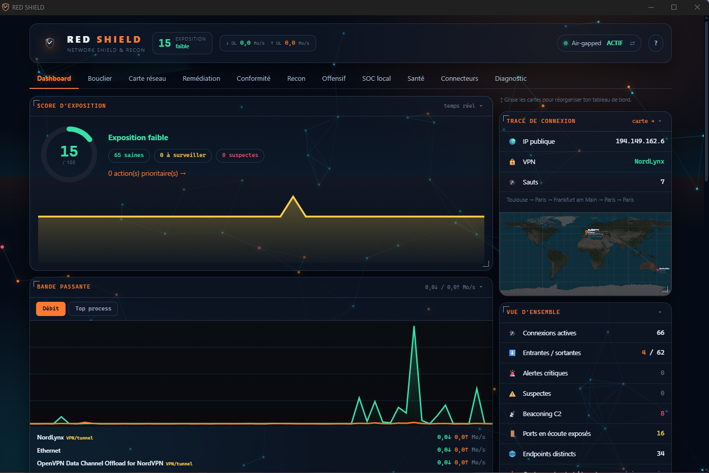
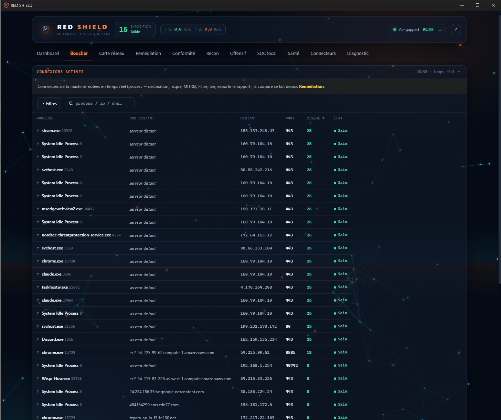
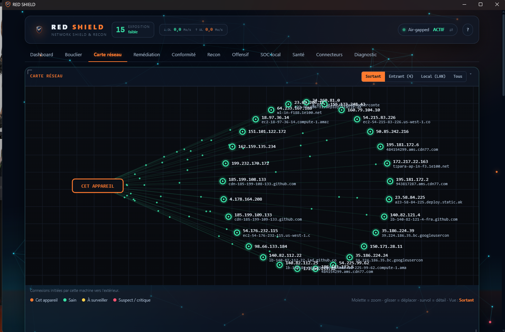
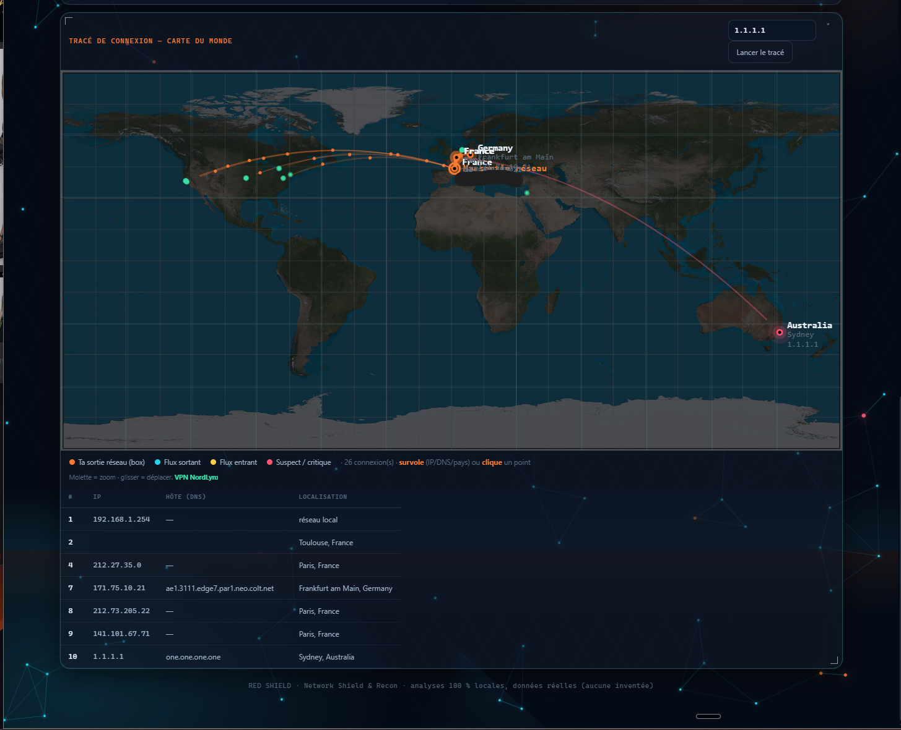
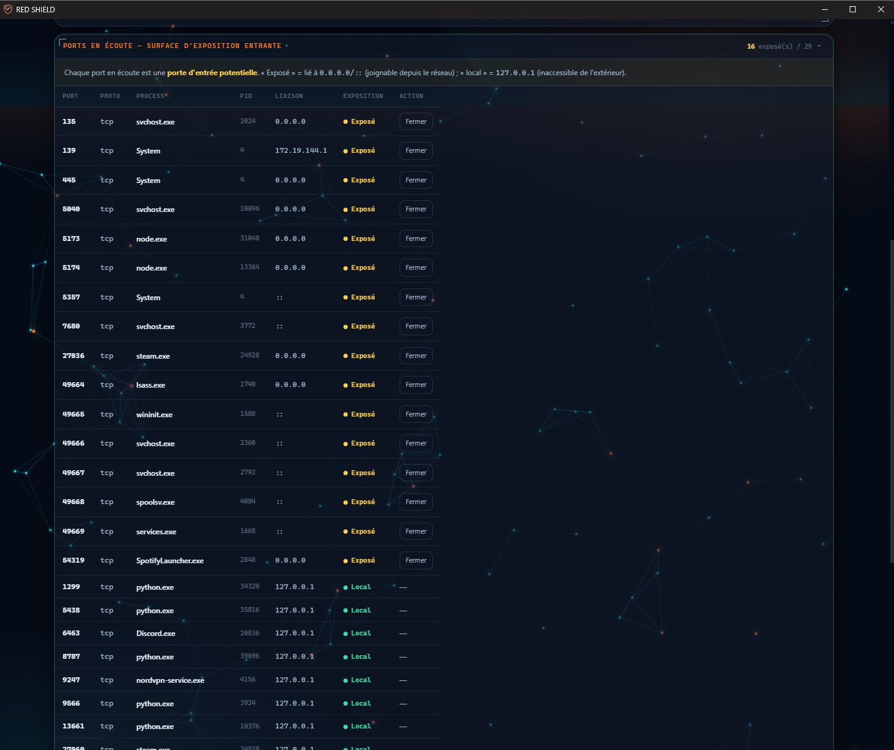
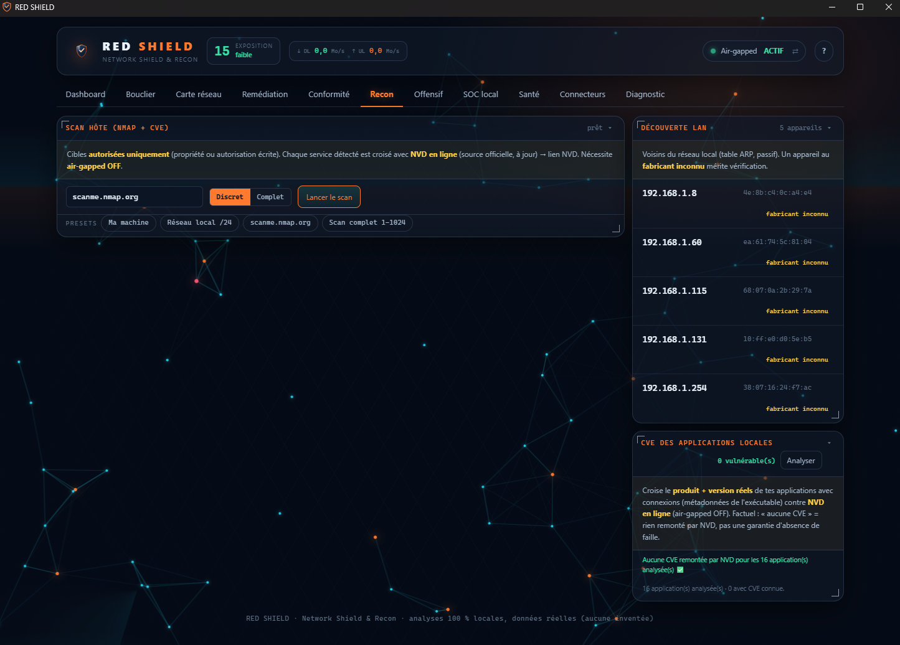
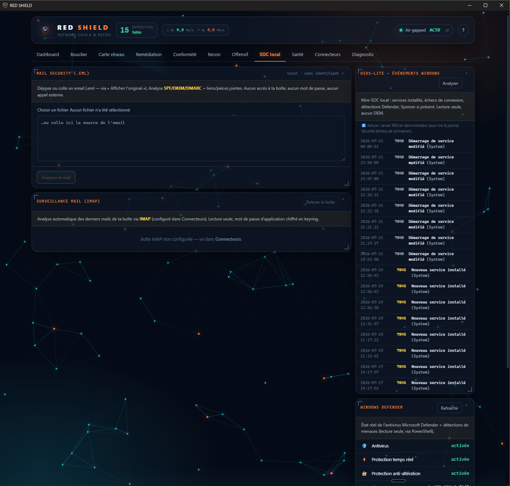
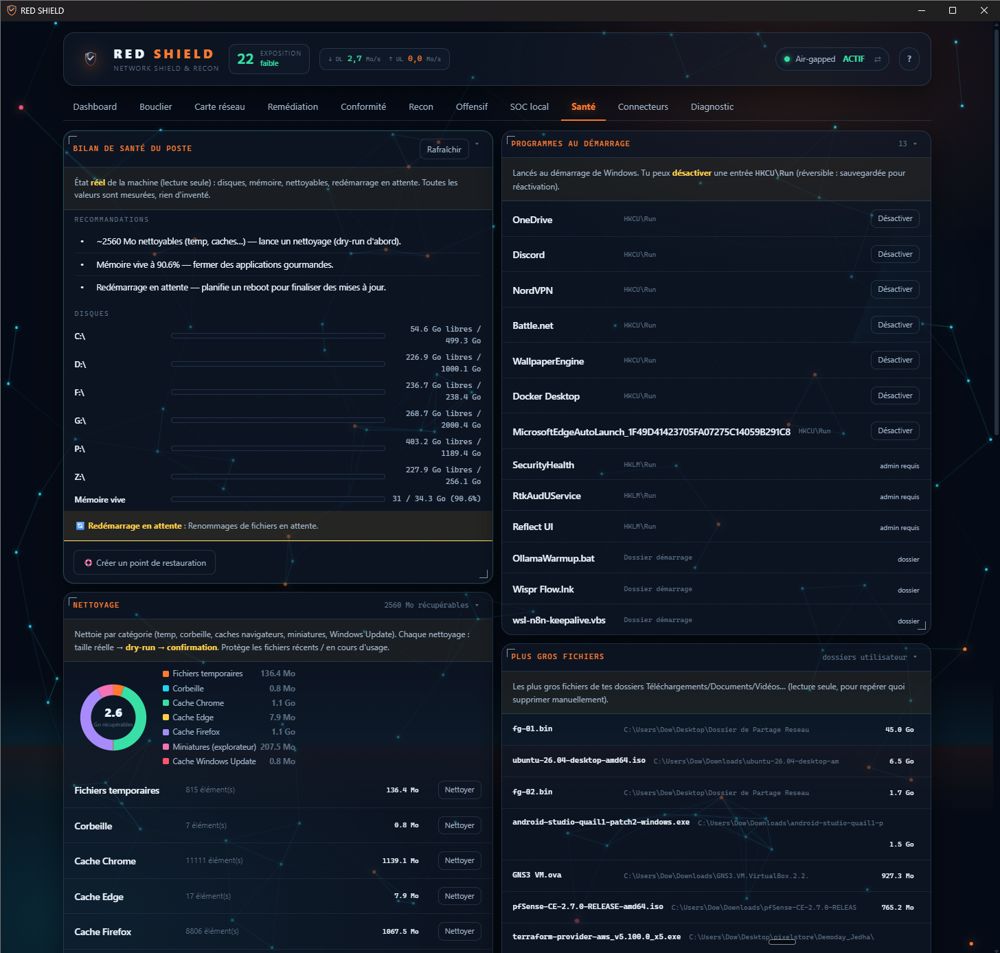
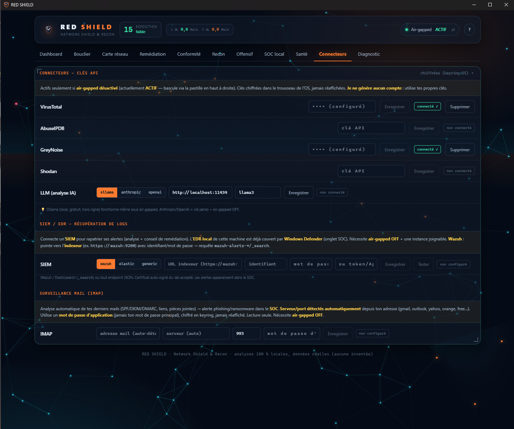
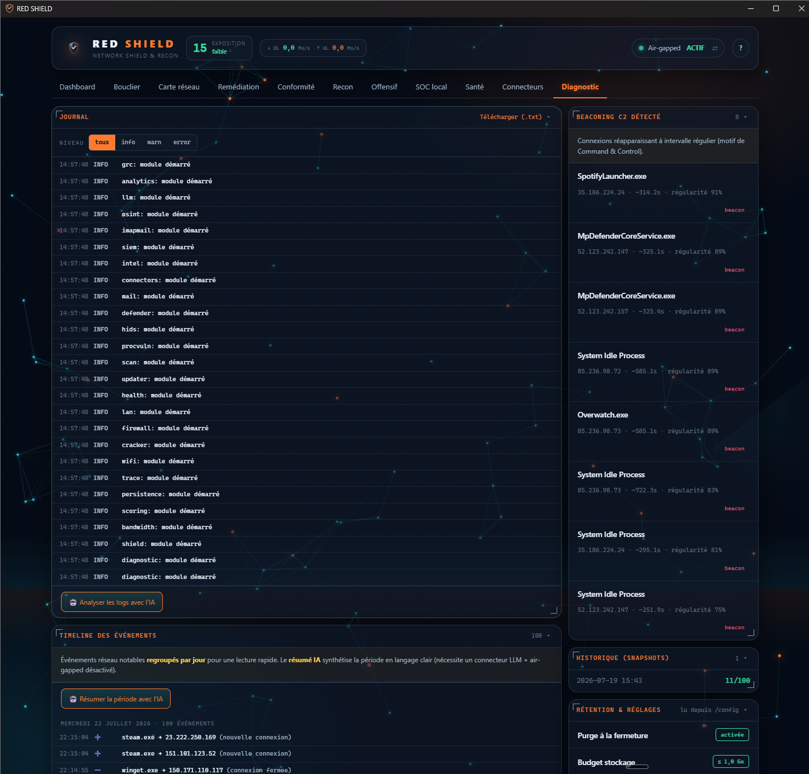

<div align="center">


# RED SHIELD

**Mon poste de commandement réseau — *red + blue*, modulaire, 100 % local.**

Une vision d'ensemble de ma machine en temps réel, et des briques que j'active selon le besoin : surveillance défensive, reconnaissance offensive, SOC, remédiation, conformité, rapport de mission et santé du poste — le tout dans un seul dashboard.

[](LICENSE)
[](.github/workflows/trivy.yml)


📄 **[Fiche projet (one-pager)](docs/PRESENTATION.md)** · [Journal des modifications](CHANGELOG.md) · [Sécurité](SECURITY.md)

</div>

> [!WARNING]
> **Usage autorisé uniquement.** RED SHIELD s'utilise sur **ma/ta propre machine** ou sur des cibles couvertes par une **autorisation écrite** (pentest, lab). Le recon actif (nmap, traceroute) ne vise que des cibles autorisées. Un journal d'audit est tenu localement.

> [!NOTE]
> **À des fins non commerciales.** RED SHIELD est fourni pour être **téléchargé, testé et étudié**. Sa **vente et toute utilisation commerciale sont interdites** — voir [Licence](#-licence).

---

## Pourquoi je l'ai construit

J'avais besoin d'un outil qui **garde un œil sur mon ordinateur** en me donnant à la fois la **vue d'ensemble** et le **détail**, sans dépendre d'un service cloud ni envoyer mes données ailleurs. Je voulais aussi qu'il soit **modulaire** — que chaque capacité soit une brique indépendante que j'active, ignore ou remplace selon mes besoins, sans que le reste tombe.

De là, j'ai assemblé les deux moitiés du métier dans une seule interface :

- une **partie défensive (blue team)** — observer, noter, expliquer et corriger ce qui se passe sur le réseau et le poste ;
- une **partie offensive / reconnaissance (red team)** — scanner, cartographier, énumérer, tester ;
- et par-dessus, une couche **GRC** (gouvernance, risque, conformité) pour rattacher tout ça à des référentiels reconnus.

Le résultat, c'est **RED SHIELD** : un **bouclier réseau modulaire**, pensé comme un poste de commandement, où j'ai voulu qu'aucune valeur affichée ne soit inventée — c'est du **réel mesuré**, ou l'état « non connecté », jamais de la donnée de démo.

---

## 📑 Sommaire
- [Captures d'écran](#-captures-décran)
- [Fonctionnalités](#-fonctionnalités)
  - [Vue d'ensemble & bouclier](#️-vue-densemble--bouclier-blue-team)
  - [Reconnaissance & offensif](#-reconnaissance--offensif-red-team)
  - [SOC local & remédiation](#-soc-local--remédiation)
  - [Conformité — assistant CISO (GRC)](#-conformité--assistant-ciso-grc)
  - [Rapport de mission (PDF)](#-rapport-de-mission-livrable-pdf)
  - [Santé du poste](#-santé-du-poste)
  - [Connecteurs, IA & extensibilité](#-connecteurs-ia--extensibilité)
  - [Moteur mobile autonome](#-moteur-mobile-autonome)
- [Architecture](#-architecture)
- [Stack technique](#️-stack-technique)
- [Installation & lancement](#-installation--lancement)
- [Sécurité & confidentialité](#-sécurité--confidentialité)
- [Tests](#-tests)
- [Licence](#-licence)
- [Avertissement](#-avertissement)

---

## 📸 Captures d'écran

_Thème « Command Grid », données réelles (rien d'inventé). Air-gapped actif._

| Dashboard — vue d'ensemble temps réel | Bouclier — connexions notées & MITRE |
|:---:|:---:|
|  |  |
| **Carte réseau — graphe interactif** | **Carte du monde — traceroute géolocalisé** |
|  |  |
| **Ports en écoute — surface d'exposition** | **Recon — nmap + CVE (NVD) + LAN** |
|  |  |
| **SOC local — Mail, HIDS & Defender** | **Santé — bilan du poste (esprit CCleaner)** |
|  |  |
| **Connecteurs — VT / SIEM / IMAP / LLM chiffrés** | **Diagnostic — journal, beaconing, timeline** |
|  |  |

> D'autres vues (Remédiation, Conformité/GRC, Offensif) sont disponibles directement dans l'application.

---

## ✨ Fonctionnalités

### 🛡️ Vue d'ensemble & bouclier (blue team)

- **Dashboard « Command Grid »** : score d'exposition **0-100** en direct (jauge + sparkline), répartition saines / à surveiller / suspectes, débit et top process, raccourcis vers les actions prioritaires — le tout sur un fond cyber animé.
- **Bouclier temps réel** : chaque connexion avec sa lignée complète **process → PID → exécutable → arbre parent**, **résolution DNS inverse**, **sens entrant/sortant**, et un **score de risque expliqué** avec **corrélation MITRE ATT&CK**.
- **Métriques réseau agrégées** : entrant/sortant, TCP/UDP, sockets UDP, **chiffré vs clair**, **ports en écoute** (surface d'exposition : exposé au réseau vs local), **pays distincts géolocalisés hors-ligne** avec les process à l'origine des flux.
- **Débit par processus** (Mo/s ↓/↑) et **capture des paquets entrants** via **`pktmon`** (natif Windows, mode admin) — sans pilote tiers.
- **Carte réseau interactive** (canvas maison : zoom / pan / survol, DNS sous les nœuds) en 4 vues — **Sortant / Entrant / Local (LAN) / Tous**.
- **Carte du monde** : **traceroute géolocalisé 100 % hors-ligne** (base GeoIP embarquée), tracé des **flux entrants/sortants** de mon appareil jusqu'à la box et aux destinations, détection de **VPN/tunnel**, IP publique et sauts. Points cliquables (IP, DNS, pays, process).
- **Découverte LAN** (ARP), **détection de beaconing C2** (périodicité + régularité), **timeline** des événements, **historique SQLite** (snapshots) et **export Markdown** lisible par un humain comme par une IA.

### 🎯 Reconnaissance & offensif (red team)

- **Scan nmap** enrichi : **croisement CVE en ligne (API NVD)**, **décomposition par couche OSI**, mapping **conformité CIS / ANSSI / NIST** par port, et **suggestions d'énumération**.
- **Cartographie native (sans nmap)** : moteur de reconnaissance portable en **sockets purs** — **découverte d'hôtes** (TCP + **SSDP/UPnP** pour identifier box / IoT / imprimantes), **scan de ports** avec empreinte de services (bannières), **énumération web** façon *ffuf / gobuster* (dictionnaire + détection des faux positifs) et **audit TLS** (protocoles/chiffrements faibles, certificat expiré). C'est exactement la logique portée sur mobile.
- **Garde-fou de périmètre** : déclare la ou les **cibles autorisées** ; scanner hors périmètre demande une confirmation et est **journalisé** dans la piste d'audit (traçabilité de mission).
- **Vulnérabilités des applications** installées : versions des process croisées avec les **CVE NVD** en direct.
- **Audit WiFi** (`netsh` sous Windows) : réseaux, chiffrement, canaux, évaluation du risque — l'alternative légère à aircrack là où je n'ai pas besoin d'injection.
- **Cracker de hash** : **md5 / sha1 / sha256 / sha512 / PBKDF2**, identification automatique du type, attaque par dictionnaire — pur, local, sans dépendance.
- **OSINT** : énumération de **sous-domaines** (crt.sh) quand le mode air-gapped est désactivé.

### 🚨 SOC local & remédiation

- **HIDS-lite** : lecture des **événements Windows sensibles** (services, échecs d'authentification, création de comptes, Defender/Sysmon).
- **Microsoft Defender** : état réel de l'antivirus/EDR intégré (protection temps réel, signatures, derniers scans, menaces) lu via PowerShell — aucune réécriture, que de la lecture.
- **Mail Security** : analyse d'un `.eml` (**SPF / DKIM / DMARC**, désalignement, liens et pièces jointes à risque) → **verdict + remédiation**. Fonctionne aussi côté mobile, hors-ligne.
- **Connecteur IMAP** : relève d'une boîte réelle (mot de passe d'application en keyring, **auto-détection du serveur/port** depuis l'adresse) pour scorer les derniers messages.
- **Remédiation priorisée** : investigation d'une connexion suspecte (arbre de process, techniques **MITRE ATT&CK**, **réputation threat-intel** VirusTotal / AbuseIPDB) et **couper / autoriser** via le **pare-feu Windows** — toujours en **dry-run → confirmation → annulation → audit**.

### 📋 Conformité — assistant CISO (GRC)

- Un **vrai suivi de conformité**, pas une auto-déclaration : **16 contrôles** classés par domaine et mappés à **ISO/IEC 27001:2022**, **NIST CSF 2.0** et **CIS Controls v8**, chacun avec un **« pourquoi »** et une **recommandation** en clair.
- **Contrôles techniques auto-évalués** depuis l'état réel de la machine (ports exposés, flux en clair, antivirus/EDR, correctifs en attente, connexions suspectes, journalisation) — le verdict calculé fait foi.
- **Contrôles organisationnels** (MFA, accès, sauvegardes, réponse à incident, sensibilisation, RGPD, fournisseurs…) **à évaluer soi-même** avec **preuve** : justification texte **+ pièces jointes** (capture, PDF, ticket — compressées automatiquement). La preuve est indépendante du statut et persiste localement.
- **Score pondéré par référentiel** + global, statuts *conforme / à traiter / non conforme / N-A / à évaluer*, et **export Markdown**. Tourne **en air-gapped**, zéro envoi externe.

### 📄 Rapport de mission (livrable PDF)

Le générateur de rapport de consulting, intégré à l'onglet Conformité :

- **Assemblage factuel** en un clic depuis les **données réelles** (score d'exposition, constats issus du GRC + CVE, conformité) — rien d'inventé, une section vide est masquée.
- **Document vivant, éditable directement** : tu cliques dans l'aperçu pour réécrire **n'importe quel texte** (titres compris), avec **mise en forme riche** (gras, italique, listes), tu **annotes** chaque constat, tu **masques/réordonnes**, tu ajoutes des **sections libres** (intro, contexte, conclusion) et des **captures**.
- **Marque personnalisable** (nom, logo, référence d'autorisation), **synthèse assistée par IA** optionnelle (éditable), **brouillon sauvegardé** pour reprendre plus tard.
- **Export PDF** propre (couverture éditoriale + intérieur sobre, format A4) via l'impression navigateur.

### 🩺 Santé du poste

- Bilan complet dans l'esprit d'un **CCleaner**, mais sans logiciel tiers et sans toucher au registre :
- **Espace disque récupérable** (temp, caches navigateurs Chrome/Edge/Firefox, miniatures, corbeille, Windows Update) avec **donut d'assainissement avant/après** et nettoyage **dry-run + confirmation**.
- **Programmes au démarrage** : activation/désactivation (HKCU, avec sauvegarde) pour accélérer le boot.
- **Mises à jour applicatives** via **winget** : détection des versions obsolètes et **installation guidée** (dry-run → confirmation), sans passer par un tiers.
- **Point de restauration**, RAM et top process mémoire, gros fichiers, diagnostics système.

### 🔌 Connecteurs, IA & extensibilité

- **Connecteurs** : clés API **chiffrées via keyring** (jamais en clair), avec **auto-détection** des réglages IMAP.
- **SIEM / EDR** : client **Wazuh** réel (auth sur l'indexeur, requête `wazuh-alerts-*/_search`), prêt à brancher un lab — les alertes remontent dans le SOC.
- **Analyse IA** : un **LLM local (Ollama)** ou une API au choix, appliqué aux scans, logs, mails et à la **synthèse de la timeline** — activable seulement hors air-gapped.
- **Sauvegarde / restauration** : export/import de l'**état de travail** (évaluations GRC + brouillon de rapport) dans un fichier, pour changer de poste sans rien perdre — **sans les secrets** (les clés restent dans le trousseau).
- **Détection de mise à jour** : signale quand une version plus récente est publiée (via les *releases* GitHub, hors air-gapped).

### 📱 Moteur mobile autonome

Le mobile n'est **pas** une simple console de consultation : il embarque ses **propres moteurs, côté client, sans le moteur Python**.

- **Recon natif (Rust)** : cartographie du réseau — **découverte d'hôtes** (TCP + **SSDP/UPnP**), **scan de ports** et empreinte de services, **énumération web** — via un plugin **Tauri natif**, sans root. L'interface bascule alors en **mode terrain** (onglets Recon + Offensif uniquement).
- **Analyses hors-ligne** ([`ui/src/mobile/offline.ts`](ui/src/mobile/offline.ts)) : **e-mails `.eml`** (SPF/DKIM/DMARC, liens, pièces jointes) et **identification/cassage de hash** (md5/sha1/sha256/sha512 via Web Crypto).

Empaqueté en **APK Android** par la CI (Tauri v2), il fonctionne 100 % hors-ligne, sans le moteur Python.

---

## 🧩 Architecture

Le principe directeur : une **coquille stable** — **registre de modules + bus d'événements + watchdog** — qui accueille des **briques isolées**. Un module qui plante passe 🔴 **sans faire tomber l'application** ; les modules communiquent **par le bus**, jamais en direct, et respectent tous le même **contrat** (`name`, `status`, `produces/consumes`, `health`). Une brique = un fichier.

```
RED SHIELD
├── engine/                 # Moteur Python (FastAPI)
│   └── app/
│       ├── core/           # bus · registry · watchdog
│       ├── modules/        # 27 briques isolées : shield, scan, netrecon, trace, hids,
│       │                   #   defender, mail, imapmail, siem, grc, health, updater, throughput…
│       ├── scoring/        # règles de risque · baseline · MITRE
│       └── main.py         # API + endpoints
├── ui/                     # Dashboard React / Vite / Tailwind
│   ├── src/                # App.tsx · viz.tsx (canvas) · api.ts · mobile/offline.ts
│   └── src-tauri/          # empaquetage desktop/mobile (Tauri v2 + sidecar moteur)
└── .github/workflows/      # Trivy · build desktop · build mobile (Android)
```

Détails et conventions : [`CONTRIBUTING.md`](CONTRIBUTING.md) · [`HANDOFF.md`](HANDOFF.md) · [`spec.md`](spec.md).

---

## 🛠️ Stack technique

- **Moteur** : Python 3.11+ · **FastAPI** + Uvicorn · **psutil** · **SQLModel/SQLite** · **keyring** · **maxminddb** (GeoIP hors-ligne) · **httpx** · pydantic · **PyInstaller** (sidecar).
- **Frontend** : **React 18** · **Vite 6** · **TypeScript** · **Tailwind 4** · visualisations **canvas maison** (graphe, carte du monde, jauges — aucune lib graphique lourde) · **Vitest**.
- **Desktop / mobile** : **Tauri v2** (Rust) — installeur Windows NSIS et APK Android, moteur Python embarqué en sidecar.
- **Outils système exploités** : `nmap`, `pktmon`, `netsh`, `winget`, PowerShell (Defender), API NVD, Wazuh, VirusTotal / AbuseIPDB, crt.sh, Ollama.
- **CI** : **Trivy** (vulnérabilités / secrets / mauvaises configs) + workflows de build desktop & mobile.

---

## 🚀 Installation & lancement

### Prérequis
- **Python 3.11+** (testé 3.14 — sous Windows, lancer avec `py` ; `python` est le stub Microsoft Store)
- **Node.js 18+**
- *nmap* (optionnel, onglet Recon)

### Installation rapide
```powershell
# Windows
./setup.ps1
```
```bash
# Linux / macOS
./setup.sh
```

### Lancement (2 terminaux)
```bash
# Terminal 1 — moteur
cd engine
.venv/Scripts/python.exe -m uvicorn app.main:app --port 8787    # Windows
# (Linux : .venv/bin/python -m uvicorn app.main:app --port 8787)

# Terminal 2 — dashboard
cd ui
npm run dev
```
Puis j'ouvre **http://localhost:5173** — le dashboard proxifie `/api` vers le moteur (`127.0.0.1:8787`).

### Capture de débit par processus (optionnel, Windows)
`pktmon` demande les **droits administrateur** :
```powershell
./run-admin.ps1      # auto-élévation UAC
```
Sans admin, l'application fonctionne et retombe sur le proxy « nombre de connexions ».

### Packages installables (installeur Windows & APK Android)
Les launchers sont compilés en **CI GitHub Actions** (runners sans contrainte de signature locale) :
- **Desktop** — workflow **« Build desktop (Tauri + sidecar) »** → installeur Windows **NSIS** (moteur Python embarqué en sidecar).
- **Mobile** — workflow **« Build mobile (Android APK) »** → **APK Android** (moteur autonome embarqué, hors-ligne).

Onglet **Actions** → choisir le workflow → **Run workflow** → l'artefact (installeur / APK) est publié en fin de run.

---

## 🔒 Sécurité & confidentialité

- **Mode air-gapped par défaut** : coupe **tout appel à une API tierce** (NVD, réputation, OSINT, LLM distant, SIEM). Les analyses restent **sur la machine**.
- **Zéro donnée inventée** : chaque valeur provient d'une **mesure réelle** (psutil, nmap, pktmon, Defender, GeoIP embarquée…) ou affiche l'état « non connecté ».
- **Secrets** : jamais en clair — **keyring / Credential Manager**. `.env` hors versionnement, `.env.example` sans valeur.
- **Analyse de sécurité continue** : **Trivy** à chaque push — voir [`.github/workflows/trivy.yml`](.github/workflows/trivy.yml).
- **Actions système** (couper une connexion, pare-feu, nettoyage, mise à jour) : **dry-run + confirmation + annulation + audit**.
- **API** liée à `127.0.0.1` ; validation stricte des entrées, listes blanches de commandes, aucun shell libre depuis l'UI.
- **Interface durcie** : **CSP stricte** sur la WebView (aucun script ni appel externe non autorisé) ; chaîne de **signature de code** prête pour les livrables ([`docs/SIGNING.md`](docs/SIGNING.md)).

---

## 🧪 Tests

```bash
# Backend
cd engine && .venv/Scripts/python.exe -m pytest -q      # 112 tests

# Frontend
cd ui && npx vitest run                                  # 7 tests
```

---

## 📄 Licence

Distribué sous **[PolyForm Noncommercial License 1.0.0](LICENSE)**.

✅ Autorisé : télécharger, exécuter, étudier, modifier, tester, partager — **à des fins non commerciales**.
❌ Interdit : **vendre**, commercialiser ou utiliser le logiciel à des fins commerciales.

© 2026 Dorian Poncelet (Dow08).

---

## ⚠️ Avertissement

RED SHIELD est un outil éducatif et défensif fourni « en l'état », **sans aucune garantie**. L'utilisateur est seul responsable de son usage et doit respecter la législation applicable ainsi que les autorisations nécessaires avant tout scan ou analyse d'une cible. Les auteurs déclinent toute responsabilité en cas d'usage abusif.
